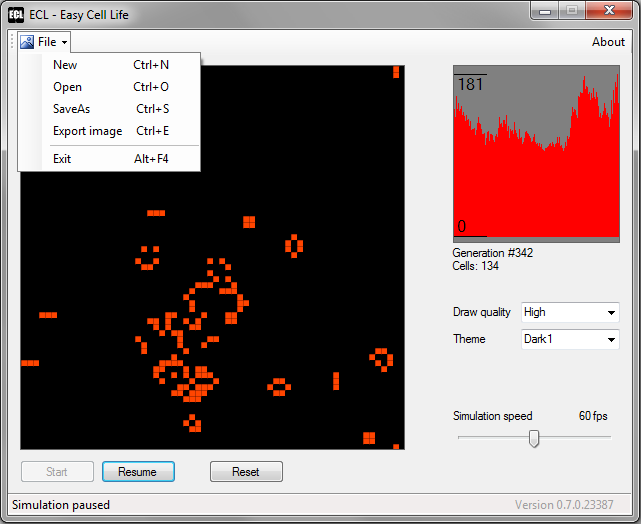

# EasyCellLife
### About
Simple cellular automaton with editor / simulator, cells count history graph, allowing saving and reusing different creations and exporting them as images.

Program is written in C# as WinForms application, compiled and tested using Windows 7 for "Any CPU" (32/64bit),

Latest release is available here - [Download](/releases) (Windows .exe)

### How to use
* Left click to grid swaps field between on and off 
* Right click to grid generates a small random shape

### Preview
Latest screenshot 
  
Simulation in action 

